# My Portfolio 


* 2023年3月18日よりエンジニアスクールRaiseTechにてAWSの学習を開始  
* このリポジトリは課題提出用に作成されました
* AWS Certified Solutions Architect - Associate　【2023年10月30日取得】

## 学習時間

<table>
    <tr>
      <td>3月</td>
      <td>16時間</td>
      <td>4月</td>
      <td>71.5時間</td>
      <td>5月</td>
      <td>75.5時間</td>
    </tr>
    <tr>
      <td>6月</td>
      <td>49.75時間</td>
      <td>7月</td>
      <td>73.25時間</td>
      <td>8月</td>
      <td>78.45時間</td>
    </tr>
    <tr>
      <td>9月</td>
      <td>77.30時間</td>
      <td>10月</td>
      <td>88.0時間</td>
      <td>11月</td>
      <td>72時間</td>
    </tr>
 </table>

[■ 学習記録をまとめたBuildUP：https://app.build-up.info/enterprises/bEDI6AXZ/portfolio/bQM0cTMgoTd](https://app.build-up.info/enterprises/bEDI6AXZ/portfolio/bQM0cTMgoTd)


## 学習成果(全16回講座)


### 第1回　【2023/04/05提出済み】

[■ learn01.md](https://github.com/nozomi2303/RaiseTech/blob/main/learn01.md)

* AWSアカウント作成、IAMの作成、MFA認証設定、Builling閲覧設定、Cloud9でHelloWorldを表示

---

### 第2回　【2023/04/09提出済み】

[■ learn02.md](https://github.com/nozomi2303/RaiseTech/blob/main/learn02.md)

* MarkDownファイルを作成
* GitBashを使用しGitHubへプルリクエストを出す

---

### 第3回　【2023/04/21提出済み】

[■ learn03.md](https://github.com/nozomi2303/RaiseTech/blob/main/learn03.md)  
[■ learn03-aboutserver.md](https://github.com/nozomi2303/RaiseTech/blob/main/learn03-aboutserver.md)


* Cloud9上にRuby on Railsで作成されたサンプルアプリケーションをデプロイ
* 各種必要なGemのインストール
* ブラウザで起動を確認
* 学んだことをまとめてGitHubでプルリクエスト

---

### 第4回　【2023/05/21提出済み】

[■ learn04.md](https://github.com/nozomi2303/RaiseTech/blob/main/learn04.md)

* コンソール上でVPC作成、EC2（Linux2）作成、とRDS（MySQL）作成する
* EC2へSSH接続
* EC2からRDSへ接続を確認する

---

### 第5回　【2023/07/18提出済み】

[■ learn05.md](https://github.com/nozomi2303/RaiseTech/blob/main/learn05.md)

* EC2上にRuby on Railsアプリケーションをデプロイ
  * 組込サーバーのみで接続確認
* NginXを組み込む
  * NginXとデフォルトサーバーで接続確認
* Unicornを組み込む
  * NginXとUnicornで接続確認
* ELB（ALB）による負荷分散機能を設定し、ヘルスチェックを確認
* S3へ画像アップロード機能を追加
  * EC2にインスタンスプロファイルを付与する
* 今回作成したインフラ環境の構成図を作る  

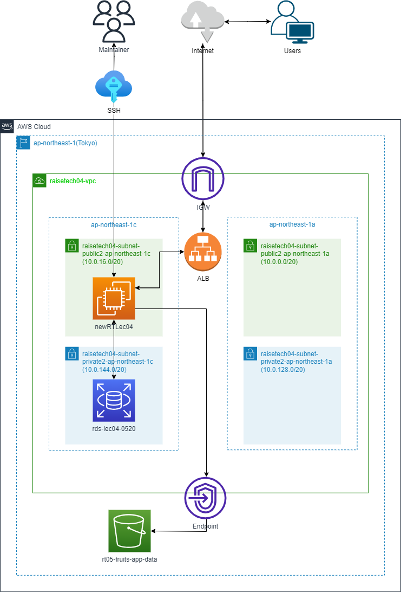 


---

### 第6回　【2023/07/24提出済み】

[■ learn06.md](https://github.com/nozomi2303/RaiseTech/blob/main/learn06.md)

* CloudTrail、CloudWatchアラームでALBのアラーム設定
* Calculatorで見積書の作成

---

### 第7回　【2023/07/30提出済み】

[■ learn07.md](https://github.com/nozomi2303/RaiseTech/blob/main/learn07.md)

* セキュリティ対策、脆弱性・認証情報の流出・人為的な過負荷に対するAWSセキュリティ対策について

---

### 第8回　【2023/08/02提出済み】

[■ learn08.md](https://github.com/nozomi2303/RaiseTech/blob/main/learn08.md)

* 第4回・第5回のライブコーディング、課題復習

---

### 第9回　【2023/08/07提出済み】

[■ learn09.md](https://github.com/nozomi2303/RaiseTech/blob/main/learn09.md)

* 第5回のライブコーディング、課題復習  


---

### 第10回　【2023/09/15提出済み】

[■ learn010.md](https://github.com/nozomi2303/RaiseTech/blob/main/learn10.md)  
[■ learn10-cfn.yml](https://github.com/nozomi2303/RaiseTech/blob/main/learn10-cfn.md)

* VPC、EC2、RDS、ALB、S3、各セキュリティグループなどこれまでに作成した環境をCloudFormationでコード化する  

* VPC-Subnet-RouteTabele-IGW  

```
  MyVPC:
    Type: AWS::EC2::VPC
    Properties:
      CidrBlock: !Ref VPCCIDR
      EnableDnsSupport: true     
      EnableDnsHostnames: true  
      Tags:
        - Key: Name
          Value: !Sub VPC-${cfnBase}
```  
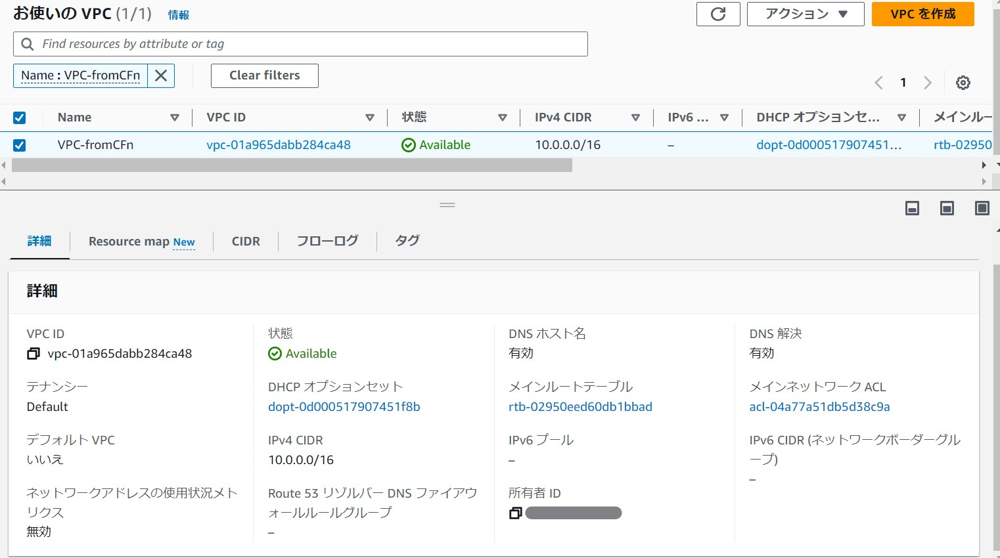   


```
  MyPBSubnet01:
    Type: AWS::EC2::Subnet
    Properties:
      AvailabilityZone: ap-northeast-1a
      VpcId: !Ref MyVPC
      CidrBlock: !Ref PBSubnetCIDR01  
      MapPublicIpOnLaunch: true   
      Tags:
        - Key: Name
          Value: !Sub MyPBSubnet01-${cfnBase}
  MyPBSubnet02:
    Type: AWS::EC2::Subnet
    Properties:
      AvailabilityZone: ap-northeast-1c
      VpcId: !Ref MyVPC
      CidrBlock: !Ref PBSubnetCIDR02
      MapPublicIpOnLaunch: true
      Tags:
        - Key: Name
          Value: !Sub MyPBSubnet02-${cfnBase}
  MyPVSubnet03:
    Type: AWS::EC2::Subnet
    Properties:
      AvailabilityZone: ap-northeast-1a   
      VpcId: !Ref MyVPC
      CidrBlock: !Ref PVSubnetCIDR03   
      MapPublicIpOnLaunch: false  
      Tags:
        - Key: Name
          Value: !Sub MyPVSubnet03-${cfnBase}
  MyPVSubnet04:
    Type: AWS::EC2::Subnet
    Properties:
      AvailabilityZone: ap-northeast-1c
      VpcId: !Ref MyVPC
      CidrBlock: !Ref PVSubnetCIDR04
      MapPublicIpOnLaunch: false
      Tags:
        - Key: Name
          Value: !Sub MyPVSubnet04-${cfnBase}
```
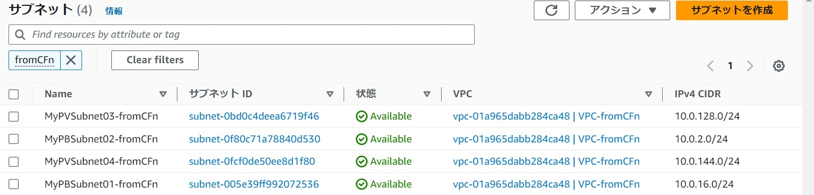   


```
  MyIGW:
    Type: AWS::EC2::InternetGateway  
    Properties:
      Tags:
        - Key: Name
          Value: MyIGW

  AttachGateway:
    Type: AWS::EC2::VPCGatewayAttachment   
    Properties:
      VpcId: !Ref MyVPC
      InternetGatewayId: !Ref MyIGW
```
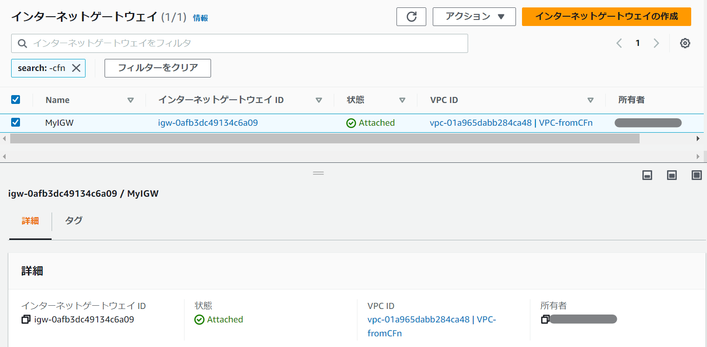   


```
  MyRouteTable:
    Type: AWS::EC2::RouteTable                     
    Properties:
      VpcId: !Ref MyVPC
      Tags:
        - Key: Name
          Value: MyRouteTablepublic
  
  MyRouteTableprivate:
    Type: AWS::EC2::RouteTable                     
    Properties:
      VpcId: !Ref MyVPC
      Tags:
        - Key: Name
          Value: MyRouteTableprivate

  MyRoutetoIGW:
    Type: AWS::EC2::Route   
    Properties:
      RouteTableId: !Ref MyRouteTable
      DestinationCidrBlock: 0.0.0.0/0   
      GatewayId: !Ref MyIGW   

  RouteTableAssocPublic01:
    Type: AWS::EC2::SubnetRouteTableAssociation  
    Properties:
      SubnetId: !Ref MyPBSubnet01
      RouteTableId: !Ref MyRouteTable

  RouteTableAssocPublic02:
    Type: AWS::EC2::SubnetRouteTableAssociation
    Properties:
      SubnetId: !Ref MyPBSubnet02
      RouteTableId: !Ref MyRouteTable

  RouteTableAssocPrivate03:
    Type: AWS::EC2::SubnetRouteTableAssociation
    Properties:
      SubnetId: !Ref MyPVSubnet03
      RouteTableId: !Ref MyRouteTableprivate

  RouteTableAssocPrivate04:
    Type: AWS::EC2::SubnetRouteTableAssociation
    Properties:
      SubnetId: !Ref MyPVSubnet04
      RouteTableId: !Ref MyRouteTableprivate
```
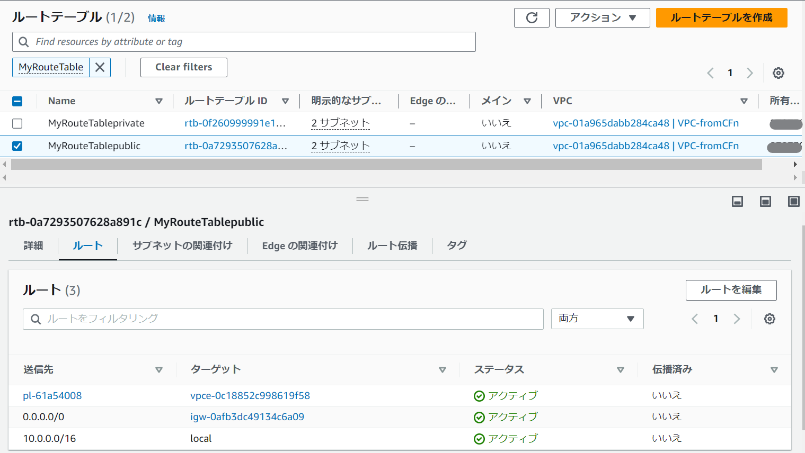   
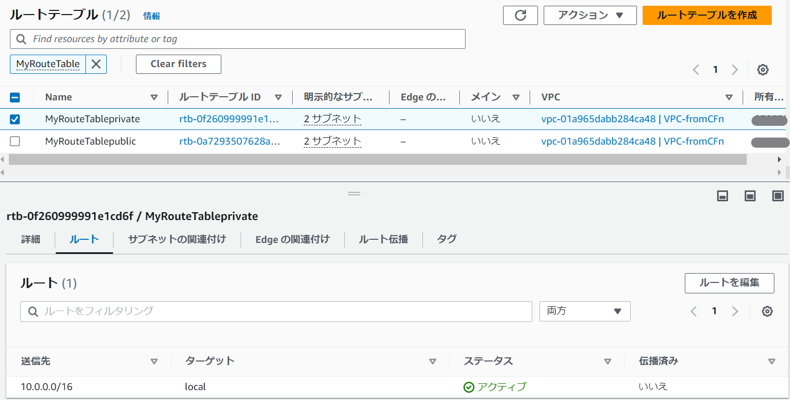   


* EC2-EC2SecurityGroup  

```
  MyEC2:
    Type: AWS::EC2::Instance  
    Properties:
      BlockDeviceMappings:  
        - DeviceName: /dev/xvda   
          Ebs:               
            DeleteOnTermination: true    
            VolumeSize: 20         
            VolumeType: gp2    
      KeyName: !Ref KeyName   
      DisableApiTermination: false                  
      ImageId: !Ref LatestAmiId    
      InstanceType: !Ref InstanceTypeParameter 
      NetworkInterfaces:
        - AssociatePublicIpAddress: "true"
          DeviceIndex: "0"
          SubnetId: !Ref MyPBSubnet01
          GroupSet: 
            - !Ref MyEC2SG 
            - !Ref MyEC2SGtoRDS                                
      UserData: !Base64 | 
        #!/bin/bash -ex
        sudo yum install -y git          
        sudo yum update -y    
        sudo timedatectl set-timezone Asia/Tokyo   
        yum install -y aws-cfn-bootstrap     
        sudo yum install mysql    
      IamInstanceProfile: !Ref MyEC2InstanceProfile  
      Tags:
        - Key: Name
          Value: !Sub MyEC2-${EC2Base}
```
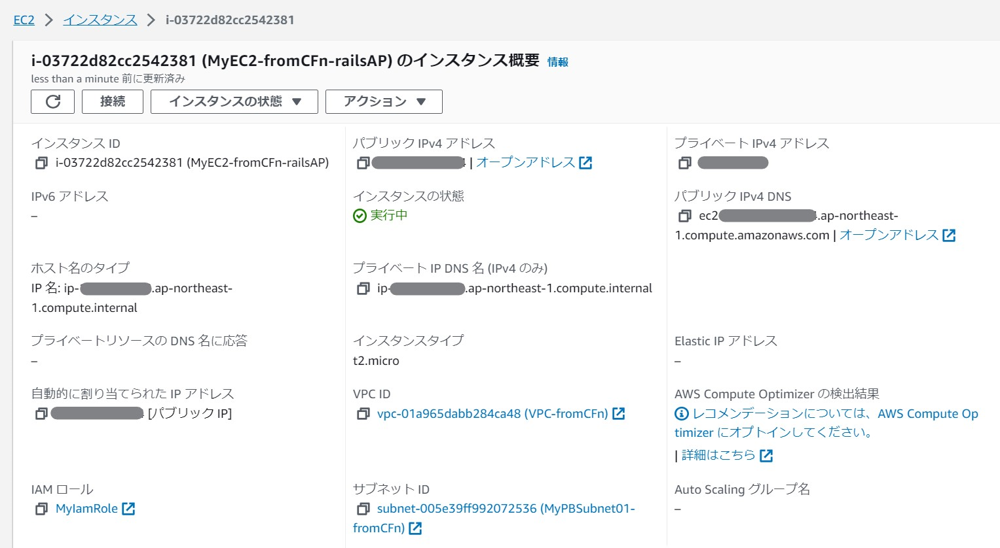   


```
  MyEC2SG:
    Type: AWS::EC2::SecurityGroup
    Properties:
      GroupName: MyEC2SG
      GroupDescription: MyEC2SG
      VpcId: !Ref MyVPC
      SecurityGroupIngress:
        - IpProtocol: tcp
          FromPort: 80
          ToPort: 80
          SourceSecurityGroupId: !Ref MyALBSG   
        - IpProtocol: tcp
          FromPort: 22
          ToPort: 22
          CidrIp: 0.0.0.0/0
        - IpProtocol: tcp
          FromPort: 443
          ToPort: 443
          CidrIp: 0.0.0.0/0
      Tags:
        - Key: Name
          Value: !Sub MyEC2SG-${cfnBase}
```
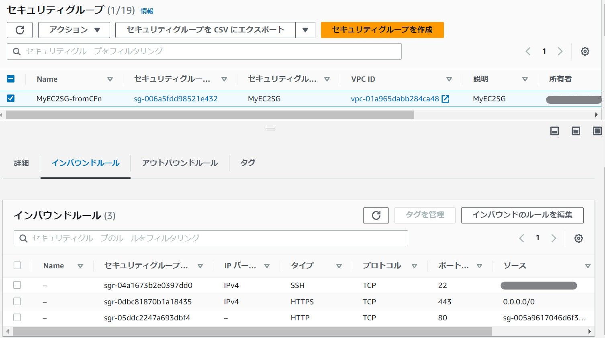   


```
 MyEC2SGtoRDS:
    Type: AWS::EC2::SecurityGroup
    Properties:
      GroupName: MyEC2SGtoRDS
      GroupDescription: EC2 access port to RDS
      VpcId: !Ref MyVPC
      SecurityGroupEgress: 
        - IpProtocol: tcp
          FromPort: 3306
          ToPort: 3306
          DestinationSecurityGroupId: !Ref RDSEC2SecurityGroup
      Tags:
        - Key: Name
          Value: !Sub MyEC2SGto-RDS-${cfnBase}
```
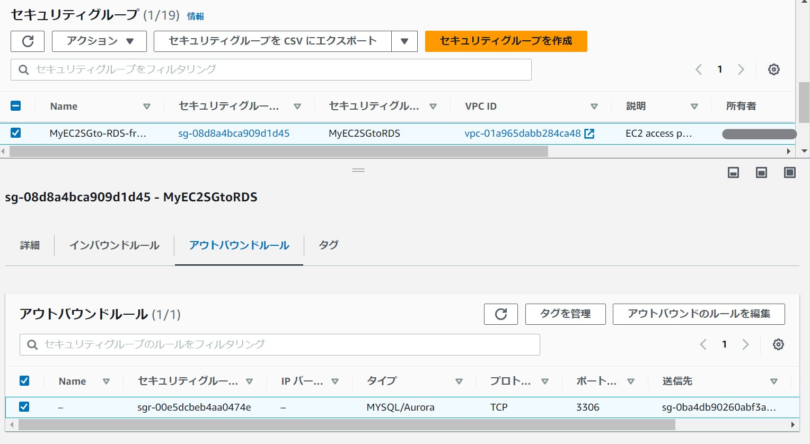   


* RDS-RDSSecurityGroup  

```
  MyRDS:
    Type: AWS::RDS::DBInstance  
    Properties:
      DBInstanceIdentifier: Learn10RDSfromCFn 
      AllocatedStorage: 20     
      DBInstanceClass: db.t2.micro
      AllowMajorVersionUpgrade: true    
      AvailabilityZone: ap-northeast-1a
      BackupRetentionPeriod: 0    
      DBName: Learn10RDSfruitsapp  
      DBSubnetGroupName: !Ref RDSSubnetGroup
      Engine: Mysql
      EngineVersion: 8.0.34
      MasterUsername: !Ref RDSmasteruser  
      MasterUserPassword: !Ref RDSpassword
      PubliclyAccessible: false    
      StorageType: gp2  
      VPCSecurityGroups: 
        - !Ref RDSEC2SecurityGroup
      Tags:
        - Key: Name
          Value: !Sub MyRDS-${cfnBase}
```

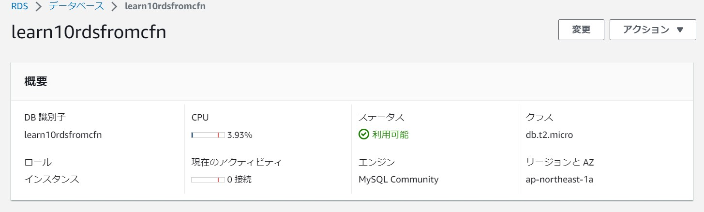    
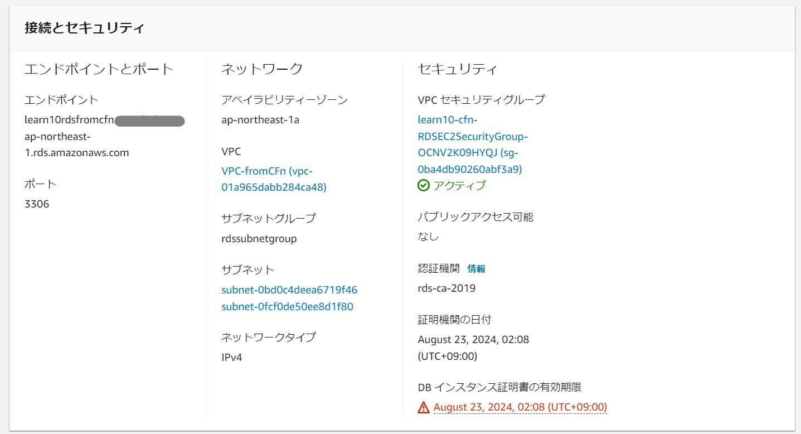    


```
  RDSEC2SecurityGroup:
    Type: AWS::EC2::SecurityGroup
    Properties:
      GroupDescription: RDS access port from EC2
      VpcId: !Ref MyVPC
      Tags:
        - Key: Name
          Value: !Sub MyRDSSG-${cfnBase}

  RDSSubnetGroup:
    Type: AWS::RDS::DBSubnetGroup
    Properties:
      DBSubnetGroupDescription: RDS subnet Group
      SubnetIds:
        - !Ref MyPVSubnet03
        - !Ref MyPVSubnet04
      DBSubnetGroupName: RDSSubnetGroup
      Tags:
        - Key: Name
          Value: !Sub RDSSubnetGroup-${cfnBase}
```

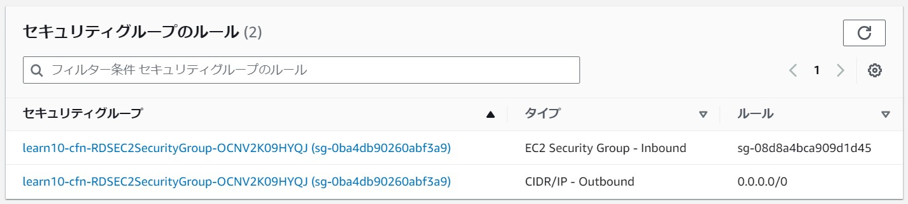    


* ALB-TargetGroup  

```
  MyALB:
    Type: AWS::ElasticLoadBalancingV2::LoadBalancer 
    Properties:
      Name: MyALB      
      Scheme: internet-facing  
      IpAddressType: ipv4
      SecurityGroups:    
        - !Ref MyALBSG
      Subnets:      
        - !Ref MyPBSubnet01
        - !Ref MyPBSubnet02
      Tags:
        - Key: Name
          Value: !Sub MyALB-${cfnBase}
 ```


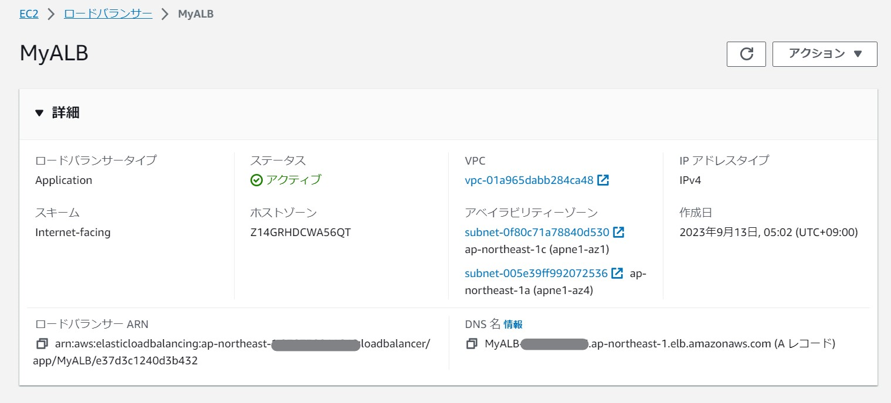    

```  MyALBSG:
    Type: AWS::EC2::SecurityGroup  
    Properties:
      GroupName: MyALBSG          
      GroupDescription: MyALBSG    
      VpcId: !Ref MyVPC        
      SecurityGroupIngress:    
        - IpProtocol: tcp   
          FromPort: 80       
          ToPort: 80      
          CidrIp: 0.0.0.0/0
      Tags:
        - Key: Name
          Value: !Sub MyALBSG-${cfnBase}
```

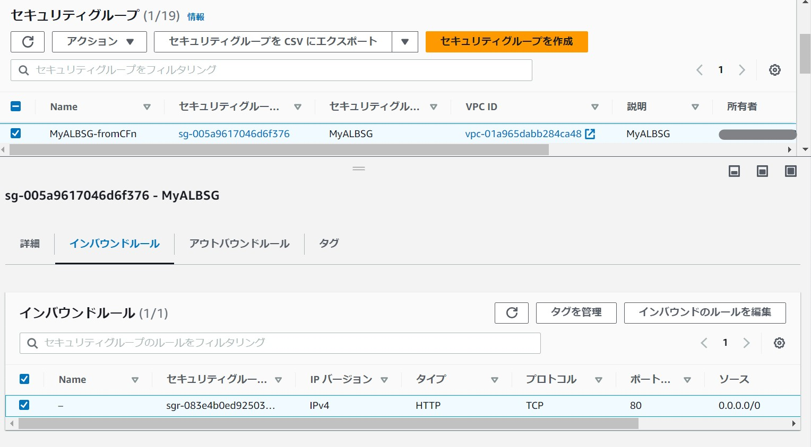    


```  TargetGroup:
    Type: AWS::ElasticLoadBalancingV2::TargetGroup 
    Properties:
      VpcId: !Ref MyVPC   
      Name: TargetGroup
      IpAddressType: ipv4
      Protocol: HTTP
      ProtocolVersion: HTTP1
      TargetType: instance
      Port: 80
      HealthCheckProtocol: HTTP    
      HealthCheckPath: /         
      HealthCheckPort: traffic-port 
      HealthyThresholdCount: 5    
      UnhealthyThresholdCount: 2
      HealthCheckTimeoutSeconds: 5    
      HealthCheckIntervalSeconds: 30    
      Matcher:  
           HttpCode: 200-399
      Targets:
           - Id: !Ref MyEC2
             Port: 80
      Tags:
        - Key: Name
          Value: !Sub MyTargetGroup-${cfnBase}
  MyALBListener:
    Type: AWS::ElasticLoadBalancingV2::Listener 
    Properties:
      Port: 80    
      Protocol: HTTP   
      DefaultActions:    
         - TargetGroupArn: !Ref TargetGroup
           Type: forward
      LoadBalancerArn: !Ref MyALB  
```
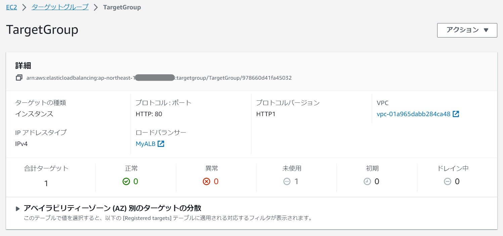    


* IAMRole  

```
  MyIamRole:
    Type: AWS::IAM::Role
    Properties:
      RoleName: MyIamRole
      AssumeRolePolicyDocument:  
        Version: 2012-10-17
        Statement:
          - Effect: Allow
            Principal:
              Service:
                - ec2.amazonaws.com
            Action:
              - sts:AssumeRole  
      Path: /
      ManagedPolicyArns: 
        - arn:aws:iam::aws:policy/AmazonS3FullAccess

  MyEC2InstanceProfile:  
    Type: AWS::IAM::InstanceProfile
    Properties: 
      Path: /
      Roles: 
        - !Ref MyIamRole 
```
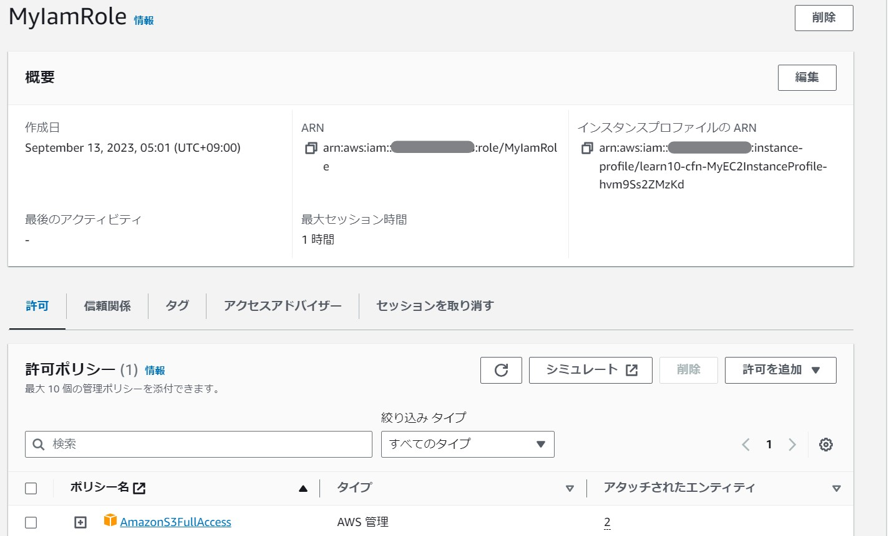    


* S3-S3EndPoint  

```  
  MyS3Bucketforlearn10:
    Type: AWS::S3::Bucket
    Properties: 
      BucketName: mys3bucketforlearn10  
      PublicAccessBlockConfiguration: 
        BlockPublicAcls: True
        BlockPublicPolicy: True
        IgnorePublicAcls: True
        RestrictPublicBuckets: True
      BucketEncryption:
        ServerSideEncryptionConfiguration:
          - ServerSideEncryptionByDefault:
              SSEAlgorithm: AES256
      Tags:
        - Key: Name
          Value: !Sub MyS3Bucketforlearn10-${cfnBase}
```
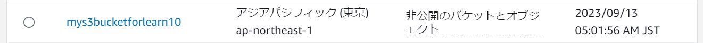    


```  
  EC2toS3EndPoint:
    Type: AWS::EC2::VPCEndpoint
    Properties: 
      ServiceName: !Sub 'com.amazonaws.${AWS::Region}.s3'
      VpcEndpointType: Gateway                    
      VpcId: !Ref MyVPC
      RouteTableIds:
        - !Ref MyRouteTable
```
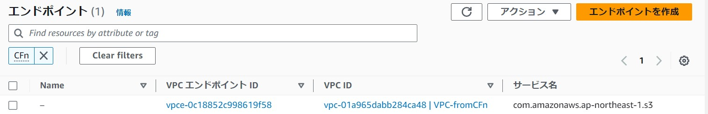    


* EC2からRDSへ接続確認  

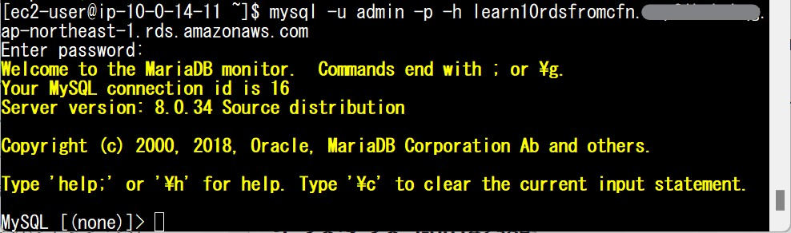    
 

  

---

  ＜第11回以降の学習予定＞

・ServerSpecのテスト

・CircleCIにServerSpec とAnsibleの処理を追加、Railsアプリケーションの自動デプロイ

・自動化した環境のAWS構成図、自動化フロー図・リポジトリのREADME作成
