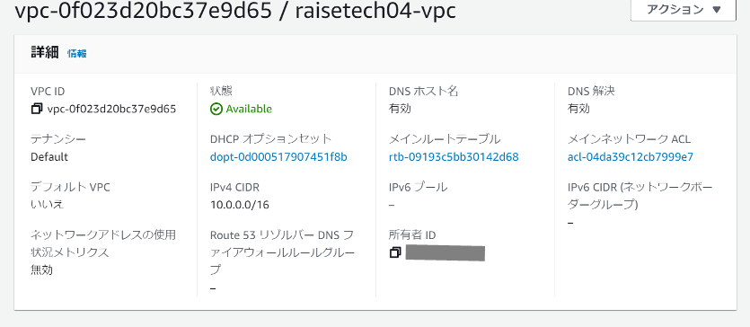
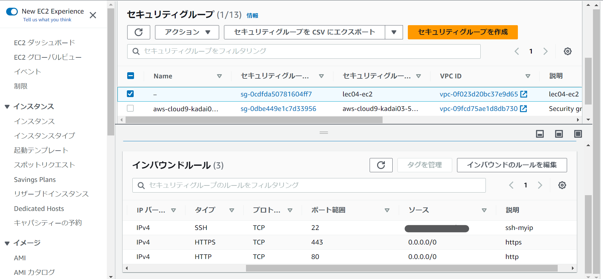
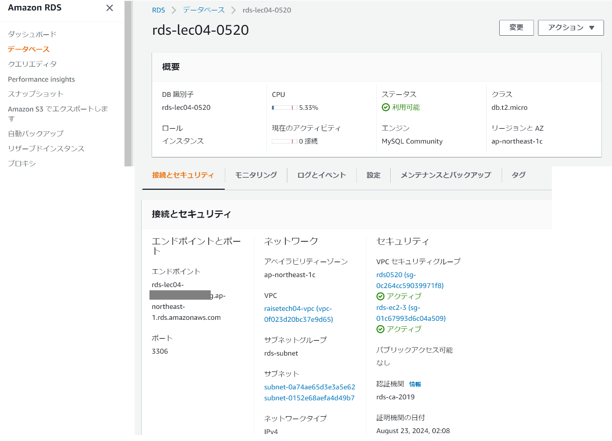
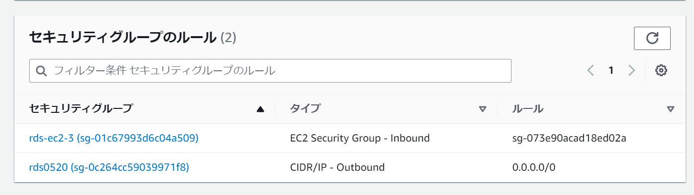
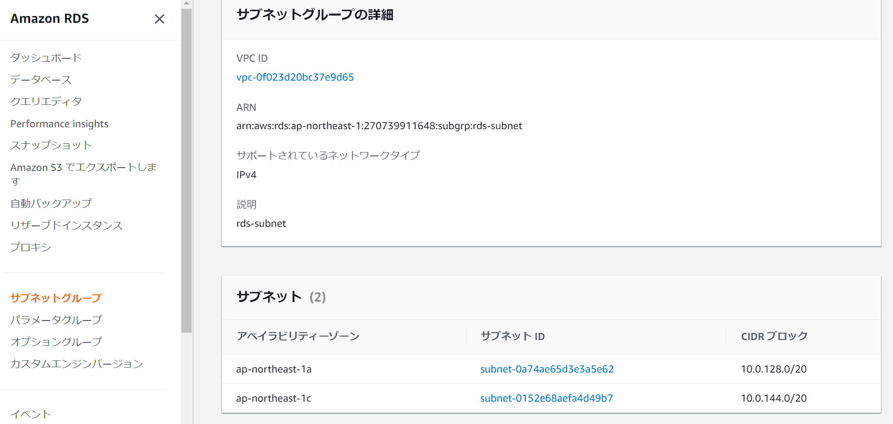
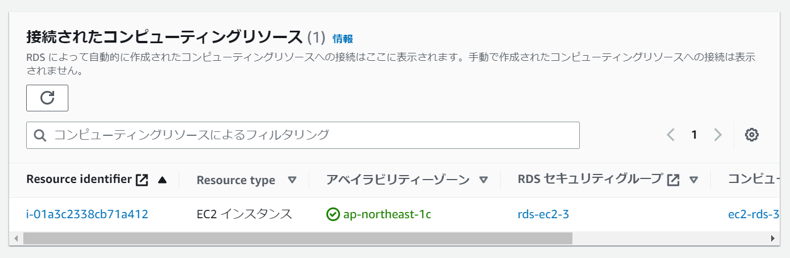
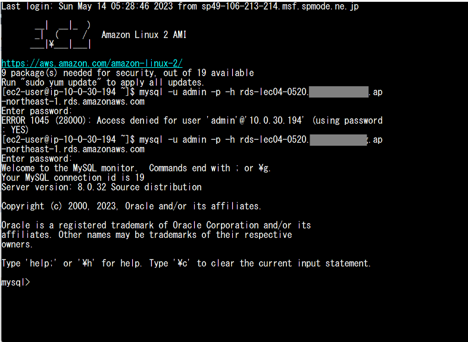

# 第4回課題

***

## VPCの作成  
    
- VPC(Virtual Private Cloud)は仮想ネットワーク。  
東京リージョン内で作成する。  
VPCの中にサブネット、外部と接続するためのインターネットゲートウェイが自動で作成される。    

***

## EC2の作成  
  

- EC2(Elastic Compute Cloud)はサーバー向けコンピュータ。  
**Linux2** で作成し、先に設置したVPC内に配置する。  
キーペアもここで作成する。  
今回はVPC内に作成し忘れてしまう、Linux2023で作成してしまうというミスのために3度目も作成してしまったので、今後は気を付けたい。  
EC2インスタンスのセキュリティグループでインバウンドルールを設定。

***

## RDSの作成  
  
  

  
- RDS(Relational Database Service)はデータベースサーバー。  
PostgreSQLやOracle、AmazonのAuroraなどあるが **MySQL** で作成。  
バックアップ設定などで容量を大量消費してしまい、無料利用枠を大幅に超えてしまった為、2度目の作成。  
RDS2度目の作成時にサブネット設定を間違えてしまい再作成。  
RDS作成後にRDSからEC2への接続。
EC2とRDSのセキュリティグループ設定を分けましょうという指示を頂いたので、RDSでセキュリティグループを設定。  
「セキュリティグループ」「サブネット」「サブネットグループ」の理解が出来ておらず、中々苦しかった。

***

## EC2からRDSへの接続
  
- TeraTermでEC2へSSH接続をし、`mysql -u admin -p -h`のコマンドの後ろへRDSのエンドポイントをペーストして実行する。  
パスワードを入力し、EC2からRDSのMySQLへログイン完了。  
再作成したRDSへのアクセス動作確認済み。  

***

**第4回を終えて**
- 調べなければならない単語がこれまでも多かったが、今回はさらに多かった気がする（多分まだまだ増える）。  
出てくる単語を全て検索しなければならないイメージだった。  
ただ、最初は比較的すんなりと課題通りにVPC・EC2・RDSの作成は出来たように感じたが、何か間違えているのでは？という不安が払拭しきれない感じがした。  
その予想通りEC2の作成時に、既に作成したVPCへ接続しなければならなかったが、そこが抜けていた原因でEC2とRDSの接続が出来ずに時間が取られてしまった。  
さらに最終的には、EC2にMySQLのインストールが出来ない事態に陥り、何故出来ないのか分からずにいたら「Linux2023が問題なのでは」という助言を頂いた。  
「Linux2023」は「Linux2」から呼び名が変わった、という勘違いをしていたがインストールされているパッケージが違うようで、詳細は現状の私では難易度が高すぎて理解が出来なかったが、とりあえずLinux2023を使うとMySQL関係でイレギュラーな事態が起きるかもというのは分かった。  
今回の課題でEC2を3回も作り直したの私だけかもしれない。  
RDSもバックアップかどこかの設定を間違えたようで、結局原因が分からないけど、無料利用枠をどんどん超えて金額が課金されていってRDSも作成し直した。  
もう一つ課金されてしまっていたのがEIPで、EIPも関連付けている間は無料だけど、関連付けたままEC2を停止しているとその停止している最中に課金されるとのこと。  
ログアウトする前には必ずEC2、RDS、EIPの停止と解除は必須であることを身を持って学んだ。  
他にもあるのかもしれない。無料利用枠を超えるとしても千円以内には抑えたいところ。  
サブネット、サブネットグループ、セキュリティグループ、のそれぞれのイメージ、対VPCとEC2、RDSへの設定の必要性など、まだまだ理解が出来ていない。  
単純に言葉だけの意味ではなく、それがどういうイメージなのか頭の中で絵が描けていない。  
もう一度しっかり復習したい。  

- 動作確認が一番の山。  
Cloud9を使って、と指定された訳ではないが、動作確認するならCloud9？と思ってSSH接続で環境を作り直したいが出来ない、というか欲しい答えが一向に検索しても見付からない。  
特にSSHキーについてが全く分からず、Amazon公式に出ていたPuTTYもインストールしたが使い方が分からず時間が過ぎていった。  
PuTTYの接続が出来た後はMySQLのインストールが出来ずに躓き、ここでVSCodeの存在を知って乗り換える。  
しかしVSCodeはさっぱり使用方法が頭に入って来ず、今度はTeraTermへ乗り換え。  
接続方法は分かりやすく使いやすいが、接続がすぐ切れてしまうのでこれは後で修正したい。  
ここで上記の通りMySQLがインストール出来ず悩んでいたら、原因が「Linux2023」であることを知る。  
EC2作成時に「Linux」であること「無料利用枠」であることのみに注視した結果「Linux2023」を選んでしまっていた。  
というか、「Linux2」が「Linux2023」にアップデートされた（名称が変わった）のだろう、くらいに考えていたので反省が必要。  
「Linux2」で作成し直し、コンソールでRDSと接続、EIPも設定しておいたので、かなりスムーズにTeraTermで再接続。  
1時間も掛からずにMySQLのインストールとRDSとの接続が無事に完了。  
3週間ほど掛かってしまったのに、最後の最後は1時間も掛からなかったのは、逆にこれまでの3週間の賜物？と思うことにしようと思う。  
PuTTYやVSCodeで躓いていたのも、もしかしたらLinux2023が原因だったのかもしれない。  

**今後に向けて**  

- やろうとしていることをしっかりイメージしなければならないと学習した。  
確保出来る時間も限られているため、焦って中々集中出来ないケースが多いのでそこも注意したい。  
質問しようと思って、質問をまとめる間に別の分からない山が出来上がってしまうので、しっかり一つ一つ整理して確認・質問することを意識したい。  
今回の第4回ではかなり躓いてほぼ心が折れてフェードアウトしそうになってしまったが挫けず今後も頑張りたい。  
何故AWSを学ぼうと思ったのか、初心を忘れないようにしたい。  

