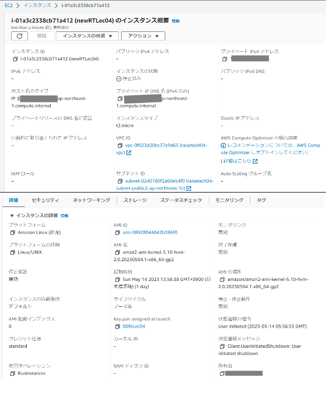

## 第4回課題  

* VPCの作成  
* EC2(Linux2)の作成  
* RDS(MySQL)の作成  
* EC2へSSH接続し、EC2からRDSへ接続

### VPCの作成  
  

### EC2の作成  
  

### RDSの作成  
  
  
  
  

### EC2へSSH接続をし、RDSと接続する  
  

### 第4回課題を終えて  

【間違えてしまったこと】  
* 作成済みのVPC選択忘れ  
* Linux2023で作成してしまった  
* RDS作成時にセキュリティグループを既存で選んでしまった
* RDSバックアップ設定を間違え無料利用枠を大幅に超えてしまった  
* SSH接続時のuser名がec2-userであるということが分かっていなかった  
  

【学んだこと】  
* EC2、RDS、EIPを使用しない間はしっかり停止や解除をすること
* BillingやAWSからのメールをしっかり確認すること  

【今後に向けて】
* セキュリティグループ、インバウンドルール、ポート番号、サブネット、サブネットグループの理解が出来ていないまま、とりあえず流れに沿って環境を構築しようとしてしまっていたのが、何度も躓く原因となり、EC2やRDSを何度も作成し直すというミスに繋がってしまいました。  
分からないままでもAWSでは簡単に構築自体は出来てしまうので、構築が出来てもその後に上手く繋がらないとかに陥ってしまうため、都度、細かく調べてしっかり理解しながら進めていかないといけないと肌で感じました。  
不明なことが多すぎたために、調べていく単語が増えて、「自分は何が分からないのか？」を見失ってしまうことが何度も続きました。  
分からないものはまずシンプルに調べて、どこまで分かっていて、何をしたいけどどこが分からないのか、をしっかり考えるために紙でも何でも一旦アウトプットし、その上で質問していけるようにしたいです。アウトプットしている間に気付く場合もありました。  
確保出来る時間も限られているため、焦って中々集中出来ないケースが多いのでそこも注意していきたいです。

