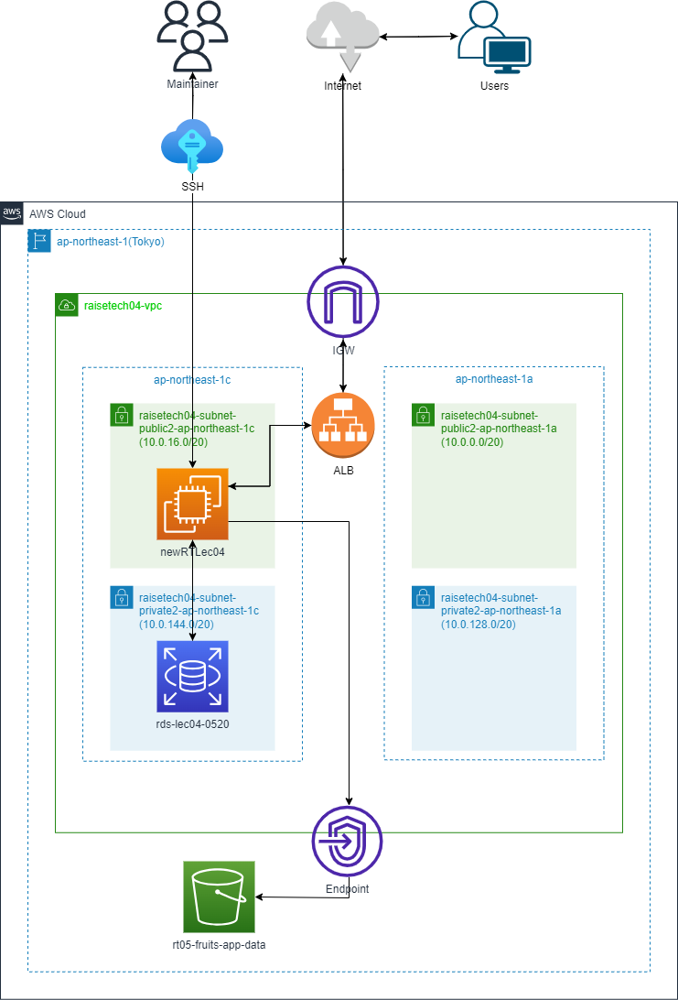

# 課題5
  
### RailsアプリをEC2へデプロイする。
  
* rails設定用ツールのインストール
  
```$ sudo yum -y update```
  
```$ sudo yum  -y install git make gcc-c++ patch libyaml-devel libffi-devel libicu-devel zlib-devel readline-devel libxml2-devel libxslt-devel ImageMagick ImageMagick-devel openssl-devel libcurl libcurl-devel curl```
  
* Node.jsをインストール
  
```$ sudo curl -sL https://rpm.nodesource.com/setup_14.x | sudo bash -```
  
```$ sudo yum -y install nodejs```
  
* Yarnをインストール
  
```$ curl -sL https://dl.yarnpkg.com/rpm/yarn.repo | sudo tee /etc/yum.repos.d/yarn.repo```
  
```$ sudo yum -y install yarn```
  
* rbenvとruby-buildをインストール
  
```$ git clone https://github.com/sstephenson/rbenv.git ~/.rbenv```
  
```$ echo 'export PATH="$HOME/.rbenv/bin:$PATH"' >> ~/.bash_profile```
  
```$ echo 'eval "$(rbenv init -)"' >> ~/.bash_profile```
  
```$ source .bash_profile```
  
```$ git clone https://github.com/sstephenson/ruby-build.git ~/.rbenv/plugins/ruby-build```
  
```$ rbenv rehash```
  
* Rubyをインストール（バージョンを3.1.2で設定、確認）
  
```$ rbenv install 3.1.2```
  
```$ rbenv global 3.1.2```
  
```$ rbenv rehash```
  
```$ ruby -v```
  
* bundlerをインストール
  
```$ gem install bundle```
  
```$ bundler -v```
  
* railsのインストール
  
```$ gem install rails```
  
* サンプルアプリケーションを持ってくる
  
```$ sudo mkdir /var/www/```
  
```$ cd /var/www/```
  
```$ sudo git clone https://github.com/yuta-ushijima/raisetech-live8-sample-app.git```
  
***

### まずは組込サーバーのみで動作させる。  
* **database.yml.sample** ファイルをコピーし、**database.yml** へ名前を変更。  
* default、development、testのusernameやsocket、パスワードなど必要な個所を修正。  
  
```$ bundle install```  

```$ bundle exec rails db:create```  
* springのエラーが出るのでGemfileからspring の部分をコメントアウト。  
  
```$ bundle exec rails db:migrate```  
* セキュリティグループのインバウンドルールで3000を許可する。  

```$ bundle exec rails server -b 0.0.0.0```  
* Pumaが起動するのでブラウザから確認する際はパブリック IPv4 DNSアドレス末尾に:3000を追記する。  


  
   
***
### Nginxサーバーを組み込んで、まずはPumaとNginxで動くようにする。  
* nginxをインストールする。  

```$ sudo amazon-linux-extras install nginx1```  
* nginx.conf内のusernameをec2-userに変更する。  
* serverコンテキスト内のserver_nameとrootを変更する。  
* puma.rbで#port3000を指定している箇所をコメントアウトする。
* nginxを起動させる。  

```$ sudo service nginx start```  
* 表示が崩れていたのでスタイルシートを読み込むように/var/lib/nginx/tmp/までのパーミッションを修正する。  
* ブラウザから確認する際はアドレスに:80を追記する。  

   

***
### Unicornサーバーを組み込む。  
* Gemfileの```#gem 'puma'```をコメントアウトする。  
* nginx.confのupstreamをunicornへ、serverのsocket指定とlocationをunicornへ記述を変更する。  
* unicorn.rbにlisten8080を追記。  
* セキュリティグループのインバウンドルールに8080を追記する。  
 
```$ bundle exec unicorn -c config/unicorn.rb -E development -p 8080```  
* ブラウザから確認する際はアドレスに:8080を追記する。  

   
***
### ELB（ALB）を追加する。  
* AWSコンソールのからロードバランサーでALBを作成する。  
* VPCはアプリを設置しているVPCで、インターネットゲートウェイに繋がっているpublicのAZを2つ指定する。  
* ALB用のセキュリティグループを作成して選択する。  
* ターゲットグループで種類をインスタンス、プロトコル/HTTPとポート番号/80で作成。  
* ヘルスチェックパスはnginxで指定したドキュメントルートと同一で。  
* unicorn動作確認時に設定したunicorn.rbに追記したlisten:8080の記述は消す。  
* webブラウザから確認する際はALBのDNSにアクセスする。  
   
***
### S3を追加し、アプリの画像登録先に設定する。  
* S3バケットをコンソールで作成する。  
* EC2インスタンスにS3Fullaccessのインスタンスプロファイルを付与する。  
* S3へアクセスセキュリティのためのエンドポイントを設定。  
* 必要なgemファイルaws-sdk-s3は既に入っていたため、画像の保存先を指定する。  
* development.rbのファイルで画像の保存先設定を、```config.active_storage.service = :amazon```へ変更する。  
* storage.ymlでamazonのregionとbucketの設定をする。  access_key_idとsecret_access_keyはインスタンスプロファイルを設定しているため不要。  
   
* アプリから画像をアップロードし、画像のEtagが一致するのを確認。  
 


***
* 第5回で作成した環境の構成図。   
 
