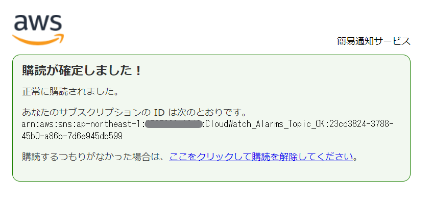
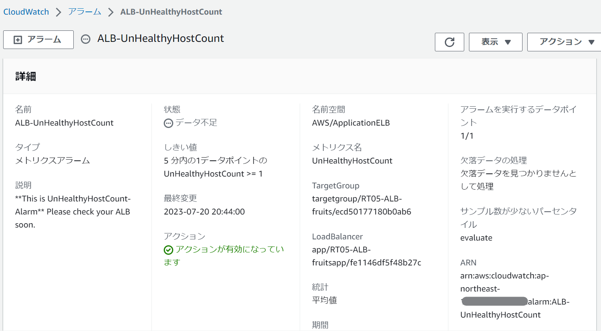
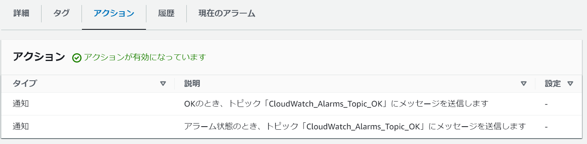
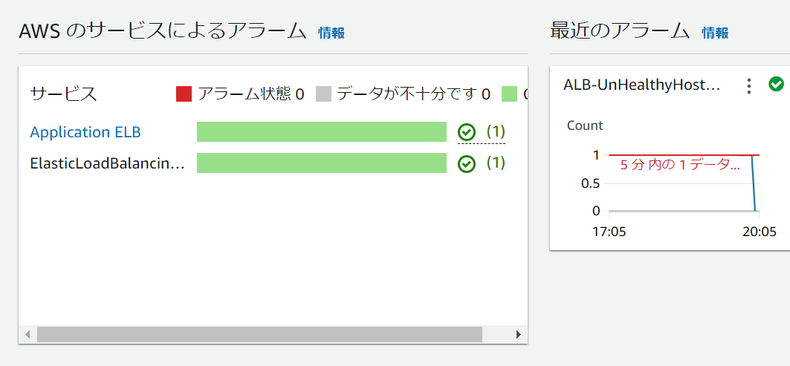
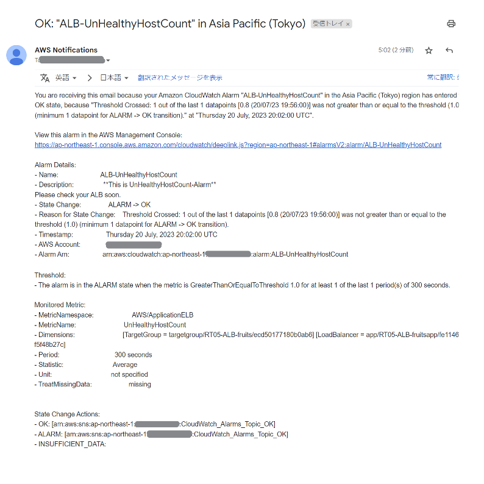
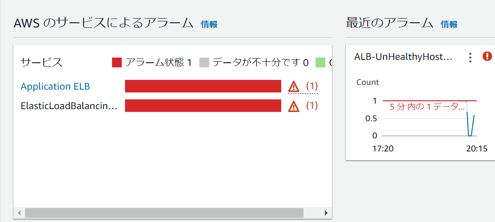
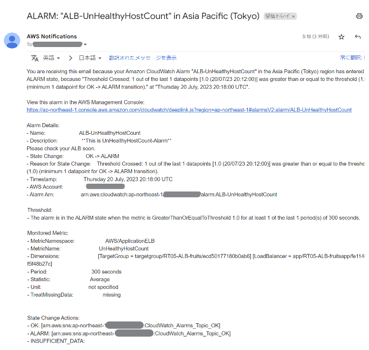
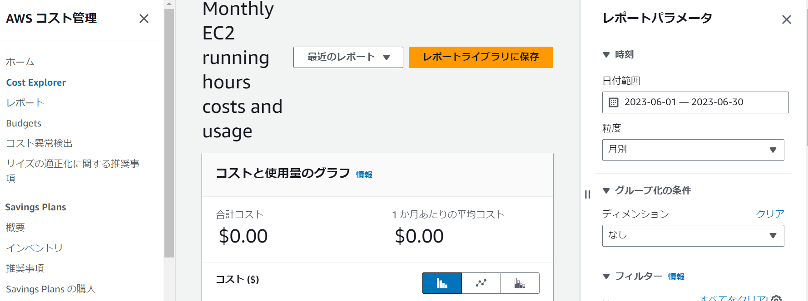

# 課題6
  
### CloudTrailのログからイベントを確認する。  
  
CloudWatchアラームでメール通知設定した際のログ  
* "eventName":"DescribeAlarms"
    * イベント名…リクエストされたアクション。アラームの説明。  
 
* "eventSource":"monitoring.amazonaws.com"  
    * イベントソース…リクエストが行われたサービス。サービス名の短縮形（ec2など）に.amazonaws.comを付けたもの。CloudWatchの場合は例外としてmonitoringになる。イベントソースとはイベント発生元となるAWSリソースで、ユーザーが操作できるエンティティのこと。エンティティとは、人や場所、商品などのオブジェクト固有の名前をテキスト参照したり日付や数量などの測定値を正確に参照すること。  
 
* "eventType":"AwsApiCall"
    * イベントタイプ…イベントレコードを生成したイベントタイプの識別。AwsApiCallは、APIが呼び出されたことを差す。  
 
* "eventCategory":"Management"
    * イベントカテゴリ…LookupEventコールで使用されるイベントカテゴリ。Managementは管理イベントのこと。LookupEventとは、CloudTrailによってキャプチャされた管理イベントのこと。  

### CloudWatchアラーム通知設定をする。  

* Amazon SNSを設定する。  
  

* 対象をALBに、UnHealthyHostCount/300秒辺りに1以上のアクセスがOKの場合とNGの場合にメールを送信する設定を行った。  
  
  

    * アクセスがOKの場合  
  
  
    * NGの場合  
  
  

### AWS見積書を作成する。  

* 今日までの課題に作ったリソースの見積書。  
    * VPC
    * EC2
    * RDS for MySQL
    * Elastic IP
    * ELB (ALB)
    * S3
    * CloudTrail
    * CloudWatch

<https://calculator.aws/#/estimate?id=b72ca9e818e2b6898ba968dfe58543895de8887f>  

* 6月のEC2請求額  
  

