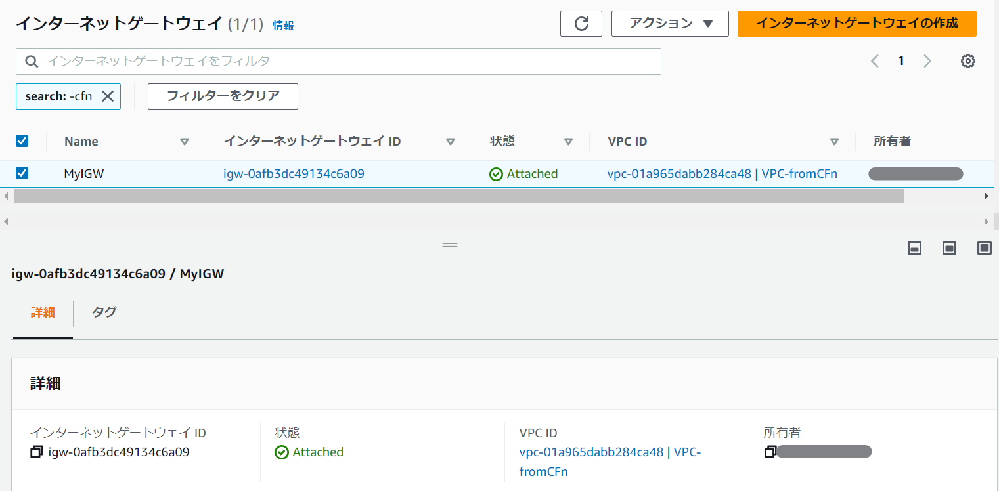
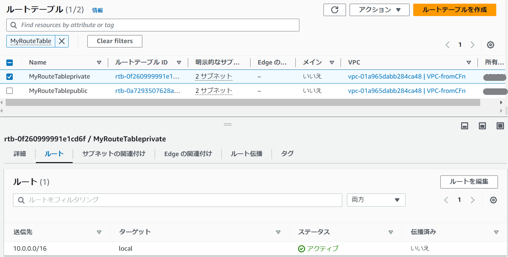
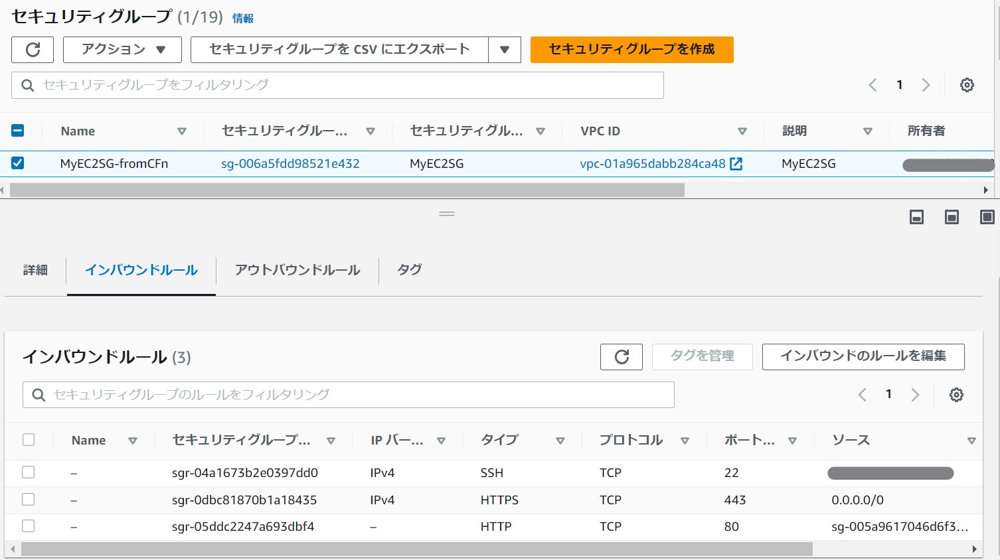
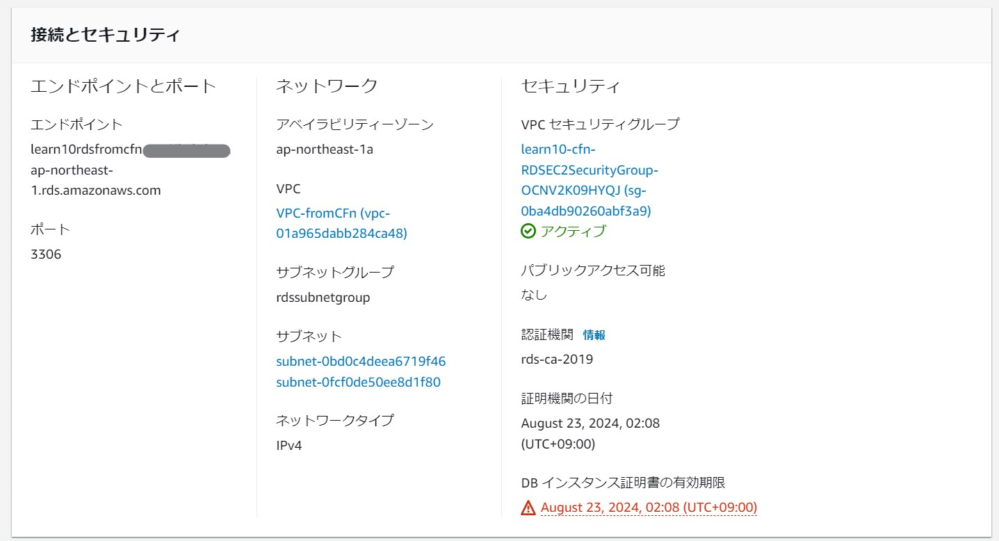
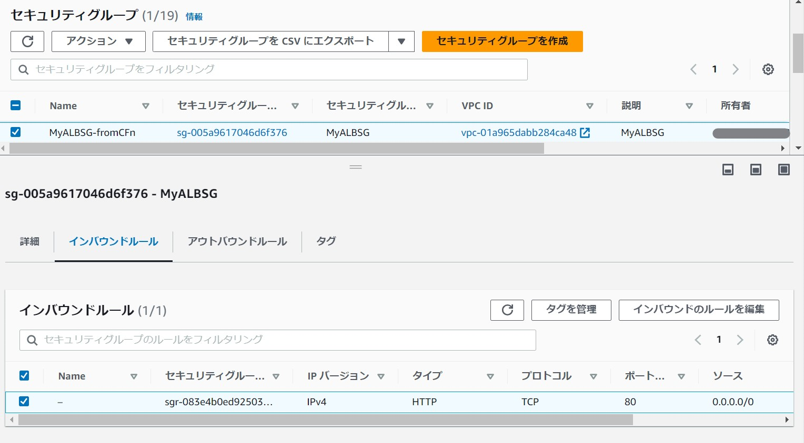
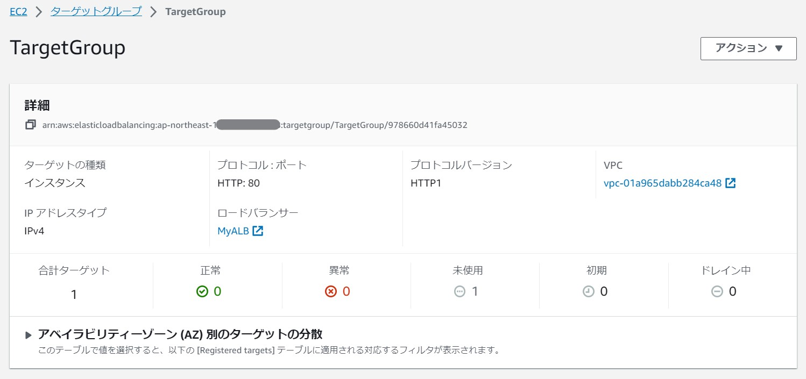
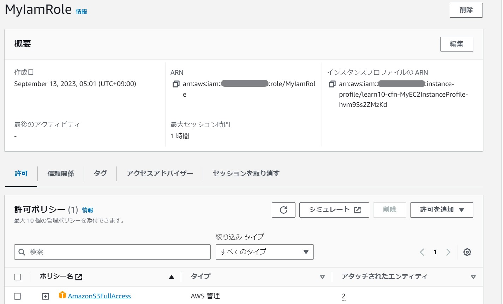
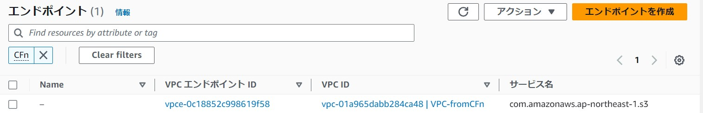
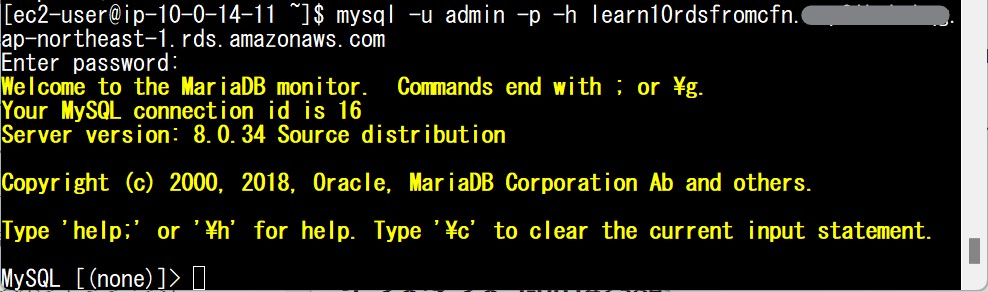

## 第10回課題

### CloudFormationを使用してこれまでの環境をコード化する


* VPC-Subnet-RouteTabele-IGW  

```
  MyVPC:
    Type: AWS::EC2::VPC
    Properties:
      CidrBlock: !Ref VPCcider   
      EnableDnsSupport: true     
      EnableDnsHostnames: true  
      Tags:
        - Key: Name
          Value: !Sub VPC-${cfnBase}
```  
   

```
  MyPBSubnet01:
    Type: AWS::EC2::Subnet
    Properties:
      AvailabilityZone: ap-northeast-1a
      VpcId: !Ref MyVPC
      CidrBlock: !Ref PBSubnetcider01  
      MapPublicIpOnLaunch: true   
      Tags:
        - Key: Name
          Value: !Sub MyPBSubnet01-${cfnBase}
  MyPBSubnet02:
    Type: AWS::EC2::Subnet
    Properties:
      AvailabilityZone: ap-northeast-1c
      VpcId: !Ref MyVPC
      CidrBlock: !Ref PBSubnetcider02
      MapPublicIpOnLaunch: true
      Tags:
        - Key: Name
          Value: !Sub MyPBSubnet02-${cfnBase}
  MyPVSubnet03:
    Type: AWS::EC2::Subnet
    Properties:
      AvailabilityZone: ap-northeast-1a   
      VpcId: !Ref MyVPC
      CidrBlock: !Ref PVSubnetcider03   
      MapPublicIpOnLaunch: false  
      Tags:
        - Key: Name
          Value: !Sub MyPVSubnet03-${cfnBase}
  MyPVSubnet04:
    Type: AWS::EC2::Subnet
    Properties:
      AvailabilityZone: ap-northeast-1c
      VpcId: !Ref MyVPC
      CidrBlock: !Ref PVSubnetcider04
      MapPublicIpOnLaunch: false
      Tags:
        - Key: Name
          Value: !Sub MyPVSubnet04-${cfnBase}
```
   

```
  MyIGW:
    Type: AWS::EC2::InternetGateway  
    Properties:
      Tags:
        - Key: Name
          Value: MyIGW

  AttachGateway:
    Type: AWS::EC2::VPCGatewayAttachment   
    Properties:
      VpcId: !Ref MyVPC
      InternetGatewayId: !Ref MyIGW
```
   

```
  MyRouteTable:
    Type: AWS::EC2::RouteTable                     
    Properties:
      VpcId: !Ref MyVPC
      Tags:
        - Key: Name
          Value: MyRouteTablepublic
  
  MyRouteTableprivate:
    Type: AWS::EC2::RouteTable                     
    Properties:
      VpcId: !Ref MyVPC
      Tags:
        - Key: Name
          Value: MyRouteTableprivate

  MyRoutetoIGW:
    Type: AWS::EC2::Route   
    Properties:
      RouteTableId: !Ref MyRouteTable
      DestinationCidrBlock: 0.0.0.0/0   
      GatewayId: !Ref MyIGW   

  RouteTableAssocPublic01:
    Type: AWS::EC2::SubnetRouteTableAssociation  
    Properties:
      SubnetId: !Ref MyPBSubnet01
      RouteTableId: !Ref MyRouteTable

  RouteTableAssocPublic02:
    Type: AWS::EC2::SubnetRouteTableAssociation
    Properties:
      SubnetId: !Ref MyPBSubnet02
      RouteTableId: !Ref MyRouteTable

  RouteTableAssocPrivate03:
    Type: AWS::EC2::SubnetRouteTableAssociation
    Properties:
      SubnetId: !Ref MyPVSubnet03
      RouteTableId: !Ref MyRouteTableprivate

  RouteTableAssocPrivate04:
    Type: AWS::EC2::SubnetRouteTableAssociation
    Properties:
      SubnetId: !Ref MyPVSubnet04
      RouteTableId: !Ref MyRouteTableprivate
```
   
   
***

* EC2-EC2SecurityGroup  

```
  MyEC2:
    Type: AWS::EC2::Instance  
    Properties:
      BlockDeviceMappings:  
        - DeviceName: /dev/xvda   
          Ebs:               
            DeleteOnTermination: true    
            VolumeSize: 20         
            VolumeType: gp2    
      KeyName: !Ref KeyName   
      DisableApiTermination: false                  
      ImageId: !Ref LatestAmiId    
      InstanceType: !Ref InstanceTypeParameter 
      NetworkInterfaces:
        - AssociatePublicIpAddress: "true"
          DeviceIndex: "0"
          SubnetId: !Ref MyPBSubnet01
          GroupSet: 
            - !Ref MyEC2SG 
            - !Ref MyEC2SGtoRDS                                
      UserData: !Base64 | 
        #!/bin/bash -ex
        sudo yum install -y git          
        sudo yum update -y    
        sudo timedatectl set-timezone Asia/Tokyo   
        yum install -y aws-cfn-bootstrap     
        sudo yum install mysql    
      IamInstanceProfile: !Ref MyEC2InstanceProfile  
      Tags:
        - Key: Name
          Value: !Sub MyEC2-${EC2Base}
```
   

```
  MyEC2SG:
    Type: AWS::EC2::SecurityGroup
    Properties:
      GroupName: MyEC2SG
      GroupDescription: MyEC2SG
      VpcId: !Ref MyVPC
      SecurityGroupIngress:
        - IpProtocol: tcp
          FromPort: 80
          ToPort: 80
          SourceSecurityGroupId: !Ref MyALBSG   
        - IpProtocol: tcp
          FromPort: 22
          ToPort: 22
          CidrIp: 0.0.0.0/0
        - IpProtocol: tcp
          FromPort: 443
          ToPort: 443
          CidrIp: 0.0.0.0/0
      Tags:
        - Key: Name
          Value: !Sub MyEC2SG-${cfnBase}
```
   

```
 MyEC2SGtoRDS:
    Type: AWS::EC2::SecurityGroup
    Properties:
      GroupName: MyEC2SGtoRDS
      GroupDescription: EC2 access port to RDS
      VpcId: !Ref MyVPC
      SecurityGroupEgress: 
        - IpProtocol: tcp
          FromPort: 3306
          ToPort: 3306
          DestinationSecurityGroupId: !Ref RDSEC2SecurityGroup
      Tags:
        - Key: Name
          Value: !Sub MyEC2SGto-RDS-${cfnBase}
```
   


***
* RDS-RDSSecurityGroup  

```
  MyRDS:
    Type: AWS::RDS::DBInstance  
    Properties:
      DBInstanceIdentifier: Learn10RDSfromCFn 
      AllocatedStorage: 20     
      DBInstanceClass: db.t2.micro
      AllowMajorVersionUpgrade: true    
      AvailabilityZone: ap-northeast-1a
      BackupRetentionPeriod: 0    
      DBName: Learn10RDSfruitsapp  
      DBSubnetGroupName: !Ref RDSSubnetGroup
      Engine: Mysql
      EngineVersion: 8.0.34
      MasterUsername: !Ref RDSmasteruser  
      MasterUserPassword: !Ref RDSpassword
      PubliclyAccessible: false    
      StorageType: gp2  
      VPCSecurityGroups: 
        - !Ref RDSEC2SecurityGroup
      Tags:
        - Key: Name
          Value: !Sub MyRDS-${cfnBase}
```

    
    

```
  RDSEC2SecurityGroup:
    Type: AWS::EC2::SecurityGroup
    Properties:
      GroupDescription: RDS access port from EC2
      VpcId: !Ref MyVPC
      Tags:
        - Key: Name
          Value: !Sub MyRDSSG-${cfnBase}

  RDSSubnetGroup:
    Type: AWS::RDS::DBSubnetGroup
    Properties:
      DBSubnetGroupDescription: RDS subnet Group
      SubnetIds:
        - !Ref MyPVSubnet03
        - !Ref MyPVSubnet04
      DBSubnetGroupName: RDSSubnetGroup
      Tags:
        - Key: Name
          Value: !Sub RDSSubnetGroup-${cfnBase}
```

    


***
* ALB-TargetGroup  

```
  MyALB:
    Type: AWS::ElasticLoadBalancingV2::LoadBalancer 
    Properties:
      Name: MyALB      
      Scheme: internet-facing  
      IpAddressType: ipv4
      SecurityGroups:    
        - !Ref MyALBSG
      Subnets:      
        - !Ref MyPBSubnet01
        - !Ref MyPBSubnet02
      Tags:
        - Key: Name
          Value: !Sub MyALB-${cfnBase}
 ```
    

```  MyALBSG:
    Type: AWS::EC2::SecurityGroup  
    Properties:
      GroupName: MyALBSG          
      GroupDescription: MyALBSG    
      VpcId: !Ref MyVPC        
      SecurityGroupIngress:    
        - IpProtocol: tcp   
          FromPort: 80       
          ToPort: 80      
          CidrIp: 0.0.0.0/0
      Tags:
        - Key: Name
          Value: !Sub MyALBSG-${cfnBase}
```

    

```  TargetGroup:
    Type: AWS::ElasticLoadBalancingV2::TargetGroup 
    Properties:
      VpcId: !Ref MyVPC   
      Name: TargetGroup
      IpAddressType: ipv4
      Protocol: HTTP
      ProtocolVersion: HTTP1
      TargetType: instance
      Port: 80
      HealthCheckProtocol: HTTP    
      HealthCheckPath: /         
      HealthCheckPort: traffic-port 
      HealthyThresholdCount: 5    
      UnhealthyThresholdCount: 2
      HealthCheckTimeoutSeconds: 5    
      HealthCheckIntervalSeconds: 30    
      Matcher:  
           HttpCode: 200-399
      Targets:
           - Id: !Ref MyEC2
             Port: 80
      Tags:
        - Key: Name
          Value: !Sub MyTargetGroup-${cfnBase}
  MyALBListener:
    Type: AWS::ElasticLoadBalancingV2::Listener 
    Properties:
      Port: 80    
      Protocol: HTTP   
      DefaultActions:    
         - TargetGroupArn: !Ref TargetGroup
           Type: forward
      LoadBalancerArn: !Ref MyALB  
```
    


***

* IAMRole  

```
  MyIamRole:
    Type: AWS::IAM::Role
    Properties:
      RoleName: MyIamRole
      AssumeRolePolicyDocument:  
        Version: 2012-10-17
        Statement:
          - Effect: Allow
            Principal:
              Service:
                - ec2.amazonaws.com
            Action:
              - sts:AssumeRole  
      Path: /
      ManagedPolicyArns: 
        - arn:aws:iam::aws:policy/AmazonS3FullAccess

  MyEC2InstanceProfile:  
    Type: AWS::IAM::InstanceProfile
    Properties: 
      Path: /
      Roles: 
        - !Ref MyIamRole 
```
    


***

* S3-S3EndPoint  

```  
  MyS3Bucketforlearn10:
    Type: AWS::S3::Bucket
    Properties: 
      BucketName: mys3bucketforlearn10  
      PublicAccessBlockConfiguration: 
        BlockPublicAcls: True
        BlockPublicPolicy: True
        IgnorePublicAcls: True
        RestrictPublicBuckets: True
      BucketEncryption:
        ServerSideEncryptionConfiguration:
          - ServerSideEncryptionByDefault:
              SSEAlgorithm: AES256
      Tags:
        - Key: Name
          Value: !Sub MyS3Bucketforlearn10-${cfnBase}
```
    

```  
  EC2toS3EndPoint:
    Type: AWS::EC2::VPCEndpoint
    Properties: 
      ServiceName: !Sub 'com.amazonaws.${AWS::Region}.s3'
      VpcEndpointType: Gateway                    
      VpcId: !Ref MyVPC
      RouteTableIds:
        - !Ref MyRouteTable
```
    


***

* EC2からRDSへ接続確認  

    


### 第10回を終えての所感  
 
　これまではコンソールで作ってきていた環境をコードにすることで、どこの機能とどこの機能が繋がっているのか、が可視化されて理解が深まったと思います。  
　関数についての理解はまだまだ足りないと感じるので、もっと使いこなせるようになれば、すっきりとしたコードが書けるのではと思いました。  
　また、今回は課題を進めることを第一に考えスタックを1つに纏めましたが、実務にあたった場合は、ネスト機能を利用してスタックも分けなければならないと思います。  
　まだまだ課題は続きますが、これまで学んできたことも忘れず理解を深めていきたいと思います。